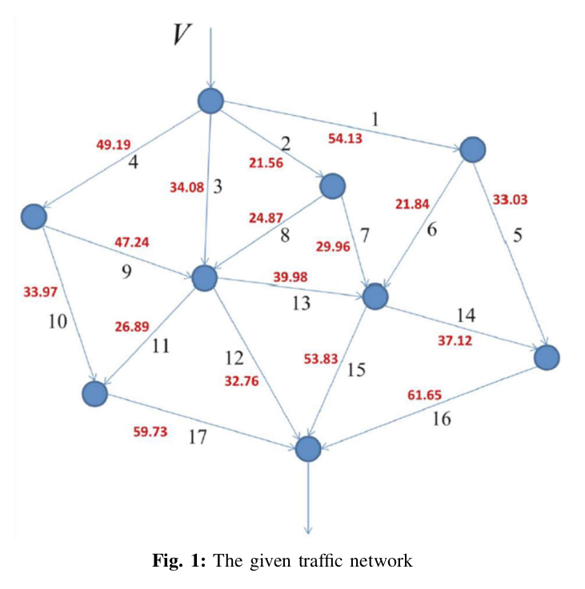

# Traffic Network Optimization – Genetic Algorithms

This repository contains the implementation of the **final project** from the *Optimization Techniques* course at the **Department of Electrical and Computer Engineering, Aristotle University of Thessaloniki**.  

The project focuses on applying **Genetic Algorithms (GA)** to a **real-world inspired traffic network optimization problem**, aiming to **minimize total travel time under congestion** while respecting road capacities and flow conservation.  

---

### 🧬 **Project 4 – Genetic Algorithms (Traffic Network Optimization)**  

The final project applied **evolutionary optimization techniques** to a real-world inspired problem:  
**minimizing total travel time in a congested traffic network.**  

#### 🚦 Problem Description  
- The network is modeled as a directed graph where **nodes** are intersections and **edges** are roads.  
- Each road *i* has:  
  - **Baseline travel time**: *t₁, t₂, …* (minutes, under negligible traffic).  
  - **Capacity**: *c₁, c₂, …* (vehicles per minute, maximum flow).  
  - **Flow variable**: *x₁, x₂, …* (vehicles per minute on road *i*).  
  - **Congestion factor**: *a₁, a₂, …*, a constant depending on road type.  

$$
T_i(x_i) = t_i + \frac{a_i x_i}{1 - \frac{x_i}{c_i}} \quad \text{[minutes]}
$$

- Properties:  
  - As $x_i \to 0$, $T_i(x_i) \to t_i$ (light traffic).  
  - As $x_i \to c_i$, $T_i(x_i) \to +\infty$ (congestion → gridlock). 

- **Constraints**:  
  - The total incoming flow at each intersection equals the total outgoing flow (no accumulation or deficits).  
  - The total input flow for the network is fixed at \(V = 100\) vehicles/minute.  

- **Objective**:  

$$
\text{Minimize} \quad T_\text{total} = \sum_{i=1}^{n} T_i(x_i)
$$
  
  subject to flow conservation and capacity constraints.  

#### 📌 Tasks  
- **Mathematical formulation** of the traffic optimization problem.  
- **Chromosome representation** of road flows $(x_1, x_2, \dots, x_n)$.  
- **Population initialization** ensuring feasibility (flows respect conservation laws and capacities).  
- **Genetic Operators**:  
  - **Selection** – roulette wheel and tournament selection.  
  - **Crossover** – combining road-flow distributions between parent solutions.  
  - **Mutation** – introducing small random changes to flows for exploration.  
- **Parameter tuning**: analyze the impact of population size, mutation rate, and crossover probability.  
- **Comparative study**: evaluate GA performance against classical methods from earlier projects (Steepest Descent, Newton, Levenberg–Marquardt).  

#### 📊 Results & Observations  
- The **GA successfully minimized total travel time** across the network while respecting road capacities and flow conservation.  
- **Mutation rate** was crucial:  
  - Too low → premature convergence to suboptimal solutions.  
  - Too high → excessive randomness, poor convergence.  
- **Crossover probability** balanced exploration vs. exploitation; optimal values helped combine partial solutions efficiently.  
- Larger populations improved solution quality but increased runtime.  
- Compared to deterministic methods, GA required more iterations but avoided local minima and achieved **better global traffic flow distribution**.  
- The project demonstrated the **practical advantage of evolutionary computation** for large-scale, non-convex optimization problems like traffic networks.  

---

## ⚙️ Tools & Implementation
- **MATLAB** was used for all implementations and simulations.  
- Detailed comments and explanations are provided in each `.m` file.  
- Reports are written in Greek, while the README provides an English overview.  
